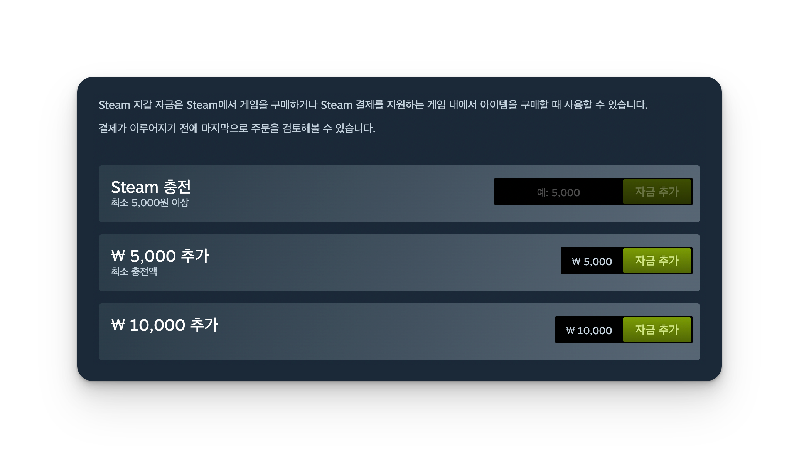

# Steam 충전 도우미

Steam 지갑에 원하는 금액을 자유롭게 충전할 수 있는 Chrome / Edge 확장 프로그램입니다.

## 기능

- 💰 커스텀 금액 입력 (페이지의 최소 충전 금액 자동 감지)
- 🌐 다국어 지원 (한국어 / English / 日本語 / 简体中文) 및 통화 자동 포맷



## 설치 방법

소스에서 직접 빌드해 로드합니다. ([pnpm](https://pnpm.io) 필요)

```bash
git clone https://github.com/GreedyLabs/extension-steam-addfunds.git
cd extension-steam-addfunds
pnpm install
pnpm build
```

1. Chrome에서 `chrome://extensions/` 접속 (Edge는 `edge://extensions/`)
2. 우측 상단 "개발자 모드" 활성화
3. "압축해제된 확장 프로그램을 로드합니다" 클릭
4. 빌드 결과물인 **`dist/`** 폴더 선택

> `pnpm build`는 `src/`의 TypeScript를 번들해 `dist/`에 로드 가능한 확장(`content.js`, `manifest.json`, `styles.css`, `_locales/`)을 생성합니다. 브라우저에는 `dist/` 폴더를 로드해야 합니다.

## 사용 방법

1. https://store.steampowered.com/steamaccount/addfunds 접속
2. 상단의 "Steam 충전" 카드에서 원하는 금액 입력
3. "자금 추가" 버튼 클릭 또는 엔터 키 입력

## 개발

```bash
pnpm install        # 의존성 설치 (최초 1회)
pnpm dev            # src/ 변경 시 dist/ 자동 재빌드 (watch)
pnpm build          # dist/ 1회 빌드
pnpm test           # 유닛 테스트 (Vitest)
pnpm check          # 타입체크 + 린트 + 포맷 + 테스트 (CI와 동일한 게이트)
pnpm build:zip      # 스토어 업로드용 extension.zip 생성
```

수정 후에는 `dist/`를 재빌드하고 `chrome://extensions/`에서 확장의 새로고침(↻)을 누르면 반영됩니다.

## 기술 스택

- TypeScript (esbuild 번들)
- Chrome Extension Manifest V3
- Vitest · ESLint · Prettier

## 라이선스

MIT
